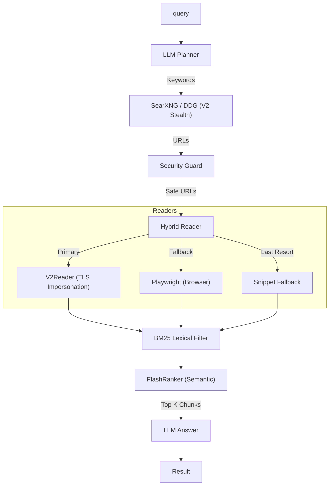

<div align="center">

# 🌐 Open-Web-Search
**The Standard Open Source Alternative to Tavily**

[](https://badge.fury.io/py/open-web-search)
[](https://opensource.org/licenses/MIT)
[](https://www.docker.com/)

</div>

**Open-Web-Search** is a privacy-first, recursive search engine designed for AI Agents.
It mimics the [Tavily API](https://tavily.com) but runs **100% locally** (or on your private cloud) using SearXNG or DuckDuckGo.

> **Our Mission**: To provide a sovereign "Web Search Layer" for the Agentic Web 2026.

**v1.0.0 Update (The 2026-Grade Architecture 🚀)**
- **Stealth & Speed (V2Reader)**: Migrated network layer to `curl_cffi` (TLS/JA3 impersonation) and `selectolax` (C-based DOM parsing) to seamlessly bypass Cloudflare and Datadome at 3x the speed.
- **Turbo Mode**: New zero-fetch architecture for sub-second Agent reasoning.
- **BM25 Filtering**: Pure-Python in-memory semantic pre-filtering.

---

## 🚀 Why Open-Web-Search?

| Feature | 🌐 Open-Web-Search | 🤖 Tavily API |
| :--- | :--- | :--- |
| **Content** | **Full Page Scraping** (V2 Reader) | Snippets (Full Text = Extra Credits) |
| **Privacy** | **100% On-Premise** (Private) | ❌ Cloud-Hosted (Data Logged) |
| **Cost** | **Free** (Self-Hosted) | Pay-per-Request (Extraction is $$) |
| **Anti-Bot**| **V2 Stealth TLS Impersonation** | - |
| **Drop-in** | ✅ Compatible Schema | - |
| **Modes**| ✅ Turbo, Fast, Balanced, Deep | ✅ "Deep Search" |

---

## ⚡ Installation & Setup

### 1. Install Library

**Option A: Install via pip (Recommended for usage)**
This installs the latest version directly from GitHub.
```bash
pip install git+https://github.com/wh5905/open-web-search.git
```

**Option B: Clone Source (Recommended for development)**
```bash
git clone https://github.com/wh5905/open-web-search.git
cd open-web-search
pip install -e .
```

<!-- (Coming Soon to PyPI: pip install open-web-search) -->

### 2. Choose Your Backend (Zero-Setup vs Pro)
Open-Web-Search runs perfectly out-of-the-box using our **V2 Stealth DuckDuckGo Engine**. 
However, for production AI agents, we strongly recommend running the **SearXNG Docker container** to unlock true Meta-Search (Google+Scholar+Bing combined) and unlimited rate limits.

| Backend Engine | 🦆 DuckDuckGo (Default) | 🚀 SearXNG (Pro - Recommended) |
| :--- | :--- | :--- |
| **Index Quality** | Limited (Bing-based, Regional bias) | **Ultimate** (Google + 70 engines combined) |
| **Setup Cost** | **Zero Setup** (Installs via pip) | Requires Docker (1 line setup) |
| **Limits** | IP Rate Limiting (Eventual) | **Unlimited** (No Blocks) |

**Want the Pro Backend? (Optional but Recommended)**
1. Ensure [Docker Desktop](https://www.docker.com/products/docker-desktop) is running.
2. Run `ows setup` in your terminal. This spins up the private Search Engine on port 8080.
*(Linker-Search will automatically detect it and upgrade your queries!).*

---

## 🧠 Why FlashRanker? (The "Deep" Brain)

Standard search APIs only give you **Snippets** (1-2 sentences). This is often not enough for complex AI tasks.
*   **Without FlashRanker**: LLM guesses based on snippets. (High Hallucination)
*   **With FlashRanker**: Linker reads the **Full Webpage**, filters it through **BM25**, and uses a specialized AI (Cross-Encoder) to pick the **Exact Paragraphs** needed.
    *   ✅ **90% Less Noise**: Ads, menus, and footers are removed instantly via `selectolax`.
    *   ✅ **Perfect Context**: Provides the "missing link" that snippets hide.

---

## 💡 Usage Scenarios

You can consume Open-Web-Search in two primary ways depending on your architecture:

### Scenario A: Universal API Server (Recommended for Agents)
Run Linker-Search as a standalone microservice. This allows any Agent Framework (LangChain, AutoGen, CrewAI) to connect to it simply by swapping out the Tavily API URL. 

> **Note:** This API server is a distinct Python process from the SearXNG Docker container. It acts as the "Brain" that manages the LLM wrappers and routing, while SearXNG (or DDG) acts as the "Eyes".

**1. Start the API Server**
```bash
# Spins up the Python API server on http://127.0.0.1:8800
# It automatically uses DuckDuckGo, OR SearXNG if you ran `ows setup` previously.
open-web-search serve
```

**2. Connect your Agent (Drop-in Replacement)**
Just point your existing Tavily tool to the local server. No code changes required!
```bash
export TAVILY_API_KEY="ows-local-key"  # Auth is bypassed locally
export TAVILY_API_URL="http://127.0.0.1:8800/search"
```

**🚀 Pro Tip: Advanced Server Requests**
You can control the exact behavior of the pipeline by passing extra JSON parameters to the `/search` endpoint:
```json
{
  "query": "Analysis of GPT-4",
  "mode": "deep",        // turbo | fast | balanced | deep
  "reranker": "flash",   // fast | flash
  "reader": "browser"    // trafilatura | browser
}
```

---

### Scenario B: Native Python Library (Direct SDK)
If you are building a pure Python application and want maximum control without network overhead, import it directly.

**Minimal Example "It Just Works"**
```python
import asyncio
import open_web_search as ows

async def main():
    # Defaults to 'balanced' mode (Fast Bi-Encoder, 5 Pages)
    result = await ows.search("Latest breakthroughs in Solid State Batteries 2026")
    
    print(f"Agent Ready Answer:\n{result.answer}\n")
    print("Top Sources:")
    for chunk in result.evidence[:3]:
        print(f"[{chunk.relevance_score:.2f}] {chunk.url}")

if __name__ == "__main__":
    asyncio.run(main())
```

**Power User: Dynamic Parameter Overrides**
Need sub-second latency for a quick chat response? Easily override the preset mode:
```python
result = await ows.search(
    "Quick market summary of TSLA",
    mode="turbo",           # Sub-second latency (Snippets Only)
    reranker_type="fast",   # Force lightweight Bi-Encoder
)
```

---

## ⚙️ Configuration Guide (v1.0.0)

### Presets (Modes)

| Mode | Lexical | Semantic | Speed | Network | Best For |
| :--- | :--- | :--- | :--- | :--- | :--- |
| **`turbo`** | **BM25** | Bi-Encoder | **< 0.8s** | 0 Pages (Snippets) | Agentic Rapid Loops |
| **`fast`** | BM25 | Bi-Encoder | **< 1.5s** | 3 Pages | Chatbots, Simple Facts |
| **`balanced`**| BM25 | Bi-Encoder | **< 3.0s** | 5 Pages | General Purpose |
| **`deep`** | - | **Flash** (GPU) | **~8.0s** | 10 Pages | Complex Research |

*(Note: `deep` mode features **Adaptive Snippet Fallback**, meaning if a site blocks the V2Reader, we salvage the search engine snippet rather than losing context.)*

### Key Options (`LinkerConfig`)

| Option | Type | Description |
| :--- | :--- | :--- |
| `mode` | `str` | Preset selector ("turbo", "fast", "balanced", "deep") |
| `reranker_type` | `str` | `"fast"` (Light) or `"flash"` (Heavy/Accurate) |
| `device` | `str` | `"auto"`, `"cuda"` (GPU), `"cpu"`, or `"mps"` (Mac) |
| `enable_stealth_escalation` | `bool` | Unlock blocked pages (403) via Browser |

---

## 🛠️ Advanced Configuration

Use `LinkerConfig` to fine-tune every aspect of the engine.

<details>
<summary><b>⚙️ View Configuration Code</b></summary>

```python
from open_web_search import LinkerConfig, SecurityConfig

config = LinkerConfig(
    # Search Engine Overrides
    engine_provider="searxng",    # 'ddg', 'searxng', 'google_cse'
    engine_base_url="http://localhost:8787",

    # Crawler Strategy
    use_neural_crawler=True,      # Use LLM (MiniLM) to predict best links
    crawler_max_depth=2,          # Recursion depth
    
    # Security Policies
    security=SecurityConfig(
        blocked_domains=["twitter.com", "facebook.com"],
        allowed_domains=["internal-wiki.corp", "192.168.1.5"],
        pii_masking=True
    )
)
```
</details>

---

## 🏗️ Architecture

<details>
<summary><b>🏗️ Architecture Diagram</b></summary>
<br>


</details>

---

## ⚖️ Legal Disclaimer

*Open-Web-Search is designed as an open-source tool to facilitate research and build intelligent agents. By utilizing the V2 Architecture (curl_cffi impersonation and DOM extraction) or fallback browsers, the end-user assumes full responsibility for adhering to the respective Terms of Service (ToS) and `robots.txt` specifications of the target domains. The developers and contributors of this library are not liable for any misuse, scraping violations, or damages arising from the operations of this software.*

---

## 🤝 Contributing

We love contributions! Please see `CONTRIBUTING.md`.
1. Fork the repo.
2. Create feature branch.
3. Submit PR.

## 📄 License
Distributed under the MIT License. See `LICENSE` for more information.
