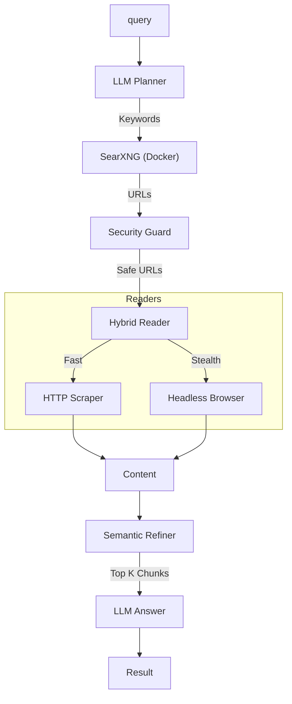

<div align="center">

# 🌐 Open-Web-Search
**The Standard Open Source Alternative to Tavily**

[](https://badge.fury.io/py/open-web-search)
[](https://opensource.org/licenses/MIT)
[](https://www.docker.com/)

</div>

**Open-Web-Search** is a privacy-first, recursive search engine designed for AI Agents.
It mimics the [Tavily API](https://tavily.com) but runs **100% locally** (or on your private cloud) using SearXNG or DuckDuckGo.

> **Our Mission**: To provide a sovereign "Web Search Layer" for the Agentic Web 2026.

---

## 🚀 Why Open-Web-Search?

| Feature | 🌐 Open-Web-Search | 🤖 Tavily API |
| :--- | :--- | :--- |
| **Content** | **Full Page Scraping** (Default) | Snippets (Full Text = Extra Credits) |
| **Privacy** | **100% On-Premise** (Private) | ❌ Cloud-Hosted (Data Logged) |
| **Cost** | **Free** (Self-Hosted) | Pay-per-Request (Extraction is $$) |
| **Intranet** | ✅ Can crawl internal IPs | ❌ Public Web Only |
| **Drop-in** | ✅ Compatible Schema | - |
| **Deep Mode**| ✅ Recursive "Research Loop" | ✅ "Deep Search" |

---

## ⚡ Installation & Setup

### 1. Install Library
```bash
pip install open-web-search
```

### 2. Setup (Required for Deep Mode)
We strongly recommend using **SearXNG** (Docker) for the best results.
```bash
# This creates a docker-compose.yml and starts SearXNG on port 8787
open-web-search setup
```

---

## 💡 Usage Scenarios

### Scenario A: Universal API Server (Recommended)
Make it accessible to ANY agent framework (LangChain, AutoGen, CrewAI) by running it as a server.
It behaves exactly like Tavily.

```bash
# Start the server (Default: http://127.0.0.1:7800)
open-web-search serve
```

**Client Configuration (e.g. within your Agent's .env):**
```bash
TAVILY_API_KEY=ows-local-key  # Arbitrary key (authentication disabled locally)
TAVILY_API_URL=http://127.0.0.1:7800/search
```

### Scenario B: Python Library (Direct)
Use it directly in your Python code for maximum control.

**Quick Start (Zero-Config)**
```python
import asyncio
import open_web_search as ows

async def main():
    # 🚀 "It Just Works" - Defaults to Balanced Mode
    result = await ows.search("What are the latest breakthroughs in Solid State Batteries?")
    
    print(result.answer)
    print("Sources:", [p.url for p in result.pages])

if __name__ == "__main__":
    asyncio.run(main())
```

**Advanced Usage (Parameter Override)**
```python
# Override options without creating a config object
result = await ows.search(
    "Quick market summary",
    mode="fast",            # Turbo mode
    reranker_type="flash",  # Use FlashRanker (v0.8.0)
    max_evidence=5
)
```

**Power User (Pipeline API)**
```python
from open_web_search import LinkerConfig, AsyncPipeline

config = LinkerConfig(mode="deep", reranker_type="flash")
pipeline = AsyncPipeline(config)
# ... reusable pipeline
```

**2. Enterprise Mode (Intranet Access)**
Securely access internal resources (Private IP) alongside the web.

```python
from open_web_search import LinkerConfig, AsyncPipeline

config = LinkerConfig(
    network_profile="enterprise",
    custom_headers={"Authorization": "Bearer MyIntranetToken"}
)
pipeline = AsyncPipeline(config)
```

<details>
<summary><b>⚡ Optimization: Turbo Mode (for Speed)</b></summary>
If you need sub-3s latency for simple chat bots (sacrificing depth):

```python
from open_web_search import LinkerConfig

# Switch to 'fast' mode (Shallow search, no recursion)
config = LinkerConfig(mode="fast")
pipeline = AsyncPipeline(config)
```
</details>

---

## 🛠️ Advanced Configuration

Use `LinkerConfig` to fine-tune every aspect of the engine.

<details>
<summary><b>⚙️ View Configuration Code</b></summary>

```python
from open_web_search import LinkerConfig, SecurityConfig

config = LinkerConfig(
    # Search Engine Overrides
    engine_provider="searxng",    # 'ddg', 'searxng', 'google_cse'
    engine_base_url="http://localhost:8787",

    # Crawler Strategy
    use_neural_crawler=True,      # Use LLM (MiniLM) to predict best links
    crawler_max_depth=2,          # Recursion depth
    
    # Security Policies
    security=SecurityConfig(
        blocked_domains=["twitter.com", "facebook.com"],
        allowed_domains=["internal-wiki.corp", "192.168.1.5"],
        pii_masking=True
    )
)
```
</details>

---

## 🏗️ Architecture



## 📊 Performance Benchmark

Real-world comparison of **Open-Web-Search (v0.7)** vs **Tavily SaaS**.

| Metric | 🚀 Open-Web-Search (Turbo) | 🧠 Open-Web-Search (Deep) | 🤖 Tavily API |
| :--- | :--- | :--- | :--- |
| **Avg Latency** | **~2.0s** | ~7.5s | **~0.9s** |
| **Cost** | **Free** (Self-Hosted) | **Free** (Self-Hosted) | Paid Tier |
| **Privacy** | ✅ **100% Private** | ✅ **100% Private** | ❌ Data sent to Cloud |
| **Context** | 📄 Top 3 Pages | 📚 **Recursive Crawl** | ✂️ Indexed Snippets |
| **Use Case** | RAG Chatbots | **Deep Research Agents** | Simple Q&A |


<details>
<summary><b>🧪 View Example Output (Sample)</b></summary>
<br>

> *Note: Content generated using a 2026-era LLM context.*

**Query:** "Top Autonomous Agent Frameworks in 2026"

```text
> Running Pipeline (Deep Mode)...
[Plan] Breakdown: ['Best Python agent frameworks 2026', 'LangGraph v2 vs CrewAI v4', 'Autogen 3.0 benchmarks']
[Search] Found 14 candidate URLs
[Filter] 2 Blocked (Legacy Docs), 12 Allowed
[Scrape] Reading 6 full pages (Trafilatura + Playwright Stealth)
[Refine] Analyzed 58 text chunks, selected 9 key evidence points
[Synth] Generating answer...
```

**Result Output (Token Stream):**
> "In 2026, the landscape of Autonomous Agents has consolidated around three dominant frameworks:
> 1. **LangGraph 2.0 (The Standard)**: Now includes a native 'Cognitive Loop' for long-running tasks and full state persistence (Time Travel debugging).
> 2. **AutoGPT v5 (Enterprise)**: Pivoted from a CLI tool to a full OS for enterprise workers, featuring 'Swarm Mode' for multi-agent collaboration.
> 3. **LlamaIndex Agents**: Specialized for 'Data-Centric' agents, excelling at RAG-heavy workflows over massive knowledge bases."
> 
> **Sources:**
> - [State of AI 2026 Report](https://stateof.ai)
> - [LangChain Blog: The Road to v2.0](https://blog.langchain.dev)
> - [AutoGPT Enterprise Announcement](https://news.agpt.co)

**Metrics:**
- **Time**: 6.82s
- **Pages Read**: 6 Full HTML Pages
- **Cost**: $0.00
</details>

---

## 🤝 Contributing

We love contributions! Please see `CONTRIBUTING.md`.
1. Fork the repo.
2. Create feature branch.
3. Submit PR.

## 📄 License
Distributed under the MIT License. See `LICENSE` for more information.

